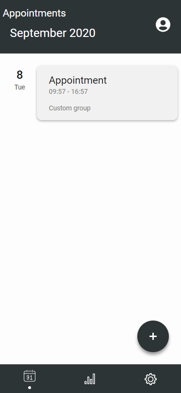
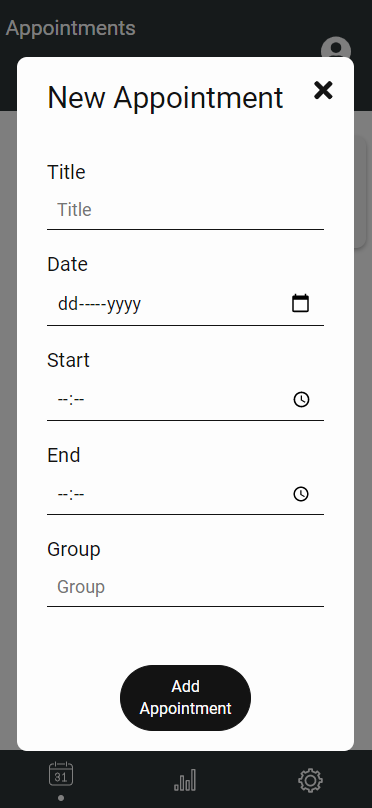
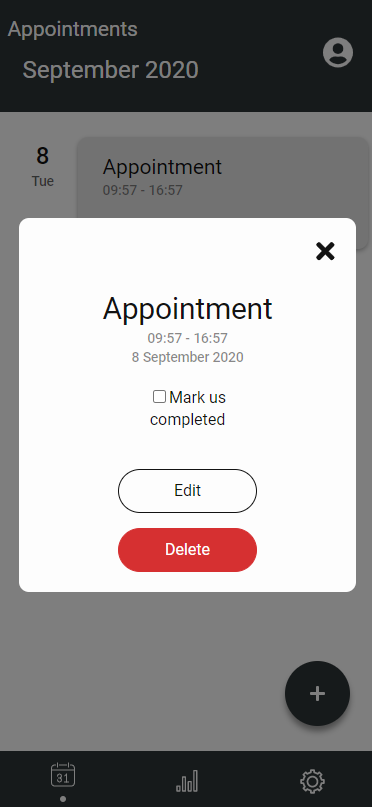
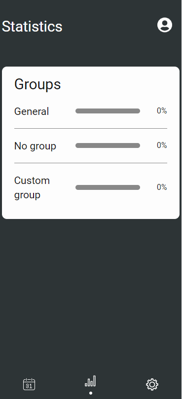
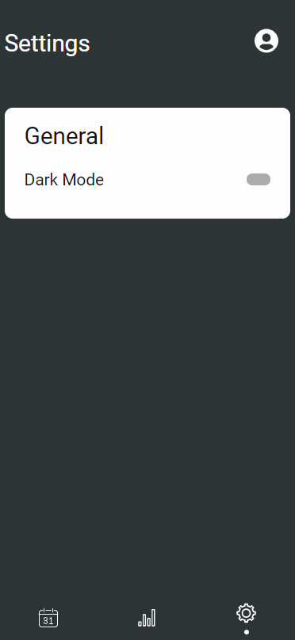

# PWA(Progressive Web App) Calendar

The core functionalities of a calendar into a PWA(Progressive Web App) - an app created with web
tehnologies(in this case React), that can be run on every device as a 'native' one. You will not
need to open the browser and search for it, there will be a homescreen icon from where you can
access it, like any other native app.     You can find the app here:
[PWA Calendar](https://pwa-calendar.netlify.app/).

## Structure

The app is structured in 3 tabs, appointments, statistics and settings.

### Appointments

This is the most important tab, from here you can create/read/update/delete(CRUD) appointments. You
can organize them by date, hour or group.

### Statistics

Here you can view statistics about all your appointments.(At this moment there is just the 'group
completion' card)  

### Settings

This tab contains settings that can be tweaked by the user.(At this moment there is just the theme
button)  

